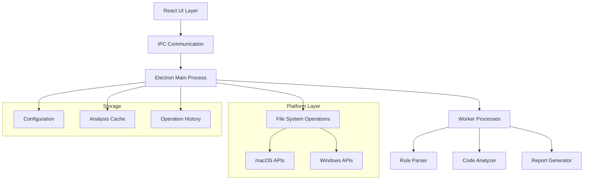

# Design Document

## Overview

The Coding Rule Checker is a cross-platform desktop application built using Electron and React that provides automated validation of C source code against customizable coding standards. The application features a modern, intuitive interface with drag-and-drop file uploads, real-time progress tracking, and comprehensive violation reporting.

The system architecture follows a multi-process design with the main Electron process handling file operations and system integration, while worker processes perform intensive code analysis to maintain UI responsiveness. The application supports both macOS and Windows with platform-specific optimizations and native look-and-feel.

## Architecture

### High-Level Architecture



### Process Architecture

1. **Main Process (Electron)**
   - Application lifecycle management
   - File system operations and security
   - Inter-process communication coordination
   - Platform-specific integrations

2. **Renderer Process (React)**
   - User interface and interaction handling
   - File upload management
   - Progress visualization
   - Results display and export

3. **Worker Processes (Node.js)**
   - Code parsing and analysis
   - Rule validation processing
   - Report generation
   - Assignment file creation

## Components and Interfaces

### Core Components

#### 1. File Manager Component
```typescript
interface FileManager {
  uploadFile(type: 'primary-rules' | 'secondary-rules' | 'source-code'): Promise<FileInfo>
  validateFile(file: File): ValidationResult
  getFileEncoding(filePath: string): string
  saveFile(content: string, suggestedName: string): Promise<string>
}

interface FileInfo {
  path: string
  name: string
  size: number
  encoding: string
  lastModified: Date
}
```

#### 2. Rule Parser Component
```typescript
interface RuleParser {
  parseRules(content: string, type: 'primary' | 'secondary'): ParsedRules
  validateRuleFormat(rules: string): ValidationResult
  extractAssignments(secondaryRules: string): Assignment[]
}

interface ParsedRules {
  rules: Rule[]
  metadata: RuleMetadata
  assignments?: Assignment[]
}

interface Rule {
  id: string
  description: string
  pattern: RegExp | string
  severity: 'error' | 'warning' | 'info'
  category: string
}
```

#### 3. Code Analyzer Component
```typescript
interface CodeAnalyzer {
  analyzeCode(sourceCode: string, rules: ParsedRules[]): Promise<AnalysisResult>
  detectViolations(code: string, rule: Rule): Violation[]
  generateCorrectedCode(code: string, violations: Violation[]): string
}

interface AnalysisResult {
  violations: Violation[]
  summary: AnalysisSummary
  correctedCode?: string
}

interface Violation {
  ruleId: string
  line: number
  column: number
  message: string
  severity: 'error' | 'warning' | 'info'
  context: string
  suggestion?: string
}
```

#### 4. Assignment Generator Component
```typescript
interface AssignmentGenerator {
  generateAssignments(secondaryRules: ParsedRules, count: number): Assignment[]
  createAssignmentFile(assignment: Assignment): string
}

interface Assignment {
  id: number
  title: string
  description: string
  template: string
  requirements: string[]
}
```

#### 5. Report Generator Component
```typescript
interface ReportGenerator {
  generateViolationReport(result: AnalysisResult): string
  generateSummaryReport(result: AnalysisResult): string
  exportReport(report: string, format: 'txt' | 'html' | 'pdf'): Promise<string>
}
```

### UI Components

#### 1. Main Application Layout
```typescript
interface MainApp {
  fileUploadArea: FileUploadComponent
  progressTracker: ProgressComponent
  resultsViewer: ResultsComponent
  menuBar: MenuComponent
}
```

#### 2. File Upload Component
```typescript
interface FileUploadComponent {
  primaryRulesUpload: FileDropZone
  secondaryRulesUpload: FileDropZone
  sourceCodeUpload: FileDropZone
  uploadProgress: ProgressBar
  fileValidation: ValidationDisplay
}
```

#### 3. Results Component
```typescript
interface ResultsComponent {
  violationsList: ViolationListView
  summaryPanel: SummaryPanel
  exportOptions: ExportPanel
  correctedCodeViewer: CodeViewer
}
```

## Data Models

### File Data Model
```typescript
interface UploadedFile {
  id: string
  type: 'primary-rules' | 'secondary-rules' | 'source-code'
  originalName: string
  path: string
  size: number
  encoding: string
  uploadedAt: Date
  content?: string
}
```

### Analysis Session Model
```typescript
interface AnalysisSession {
  id: string
  createdAt: Date
  files: UploadedFile[]
  rules: ParsedRules[]
  result?: AnalysisResult
  status: 'pending' | 'analyzing' | 'completed' | 'error'
}
```

### Configuration Model
```typescript
interface AppConfiguration {
  ui: {
    theme: 'light' | 'dark' | 'system'
    language: 'ja' | 'en'
    showProgressDetails: boolean
  }
  analysis: {
    timeoutSeconds: number
    maxFileSize: number
    enableCache: boolean
  }
  export: {
    defaultFormat: 'txt' | 'html'
    includeLineNumbers: boolean
    includeContext: boolean
  }
}
```

## Error Handling

### Error Categories

1. **File Operation Errors**
   - Invalid file format
   - File size exceeded
   - Encoding issues
   - Permission denied

2. **Analysis Errors**
   - Rule parsing failures
   - Code syntax errors
   - Memory limitations
   - Processing timeout

3. **System Errors**
   - Platform compatibility issues
   - Resource unavailability
   - Network connectivity (for updates)

### Error Handling Strategy

```typescript
interface ErrorHandler {
  handleFileError(error: FileError): UserFriendlyMessage
  handleAnalysisError(error: AnalysisError): RecoveryAction
  handleSystemError(error: SystemError): FallbackBehavior
}

interface UserFriendlyMessage {
  title: string
  message: string
  actions: Action[]
  severity: 'info' | 'warning' | 'error'
}

interface RecoveryAction {
  type: 'retry' | 'skip' | 'fallback' | 'cancel'
  description: string
  handler: () => Promise<void>
}
```

### Platform-Specific Error Handling

#### macOS
- Handle Gatekeeper restrictions
- Manage sandboxing limitations
- Deal with file permission dialogs

#### Windows
- Handle UAC prompts
- Manage antivirus interference
- Deal with file association conflicts

## Testing Strategy

### Unit Testing
- **Rule Parser Tests**: Validate rule parsing logic with various input formats
- **Code Analyzer Tests**: Test violation detection with known code samples
- **File Handler Tests**: Verify file operations across different formats and sizes
- **Report Generator Tests**: Ensure correct report formatting and content

### Integration Testing
- **End-to-End Workflow**: Test complete file upload to report generation flow
- **Cross-Platform Compatibility**: Verify consistent behavior on Mac and Windows
- **Performance Testing**: Validate processing times with large files
- **Error Recovery Testing**: Test graceful handling of various error conditions

### Test Data Strategy
```typescript
interface TestDataSet {
  validRuleFiles: TestFile[]
  invalidRuleFiles: TestFile[]
  sampleCCode: TestFile[]
  expectedViolations: ExpectedResult[]
}

interface TestFile {
  name: string
  content: string
  encoding: string
  expectedOutcome: 'success' | 'error' | 'warning'
}
```

### Automated Testing Pipeline
1. **Pre-commit Hooks**: Run unit tests and linting
2. **CI/CD Pipeline**: Execute full test suite on multiple platforms
3. **Performance Benchmarks**: Monitor analysis speed and memory usage
4. **Security Scanning**: Validate file handling security

## Performance Considerations

### Optimization Strategies

1. **Lazy Loading**: Load UI components and rules on demand
2. **Worker Processes**: Offload intensive analysis to separate threads
3. **Caching**: Store parsed rules and analysis results
4. **Streaming**: Process large files in chunks
5. **Memory Management**: Implement garbage collection for large operations

### Performance Metrics
- File upload time: < 2 seconds for 10MB files
- Rule parsing time: < 1 second for typical rule files
- Code analysis time: < 30 seconds for 1000-line C files
- Memory usage: < 500MB for typical operations
- UI responsiveness: < 100ms response time for user interactions

## Security Considerations

### File Security
- Validate file types and extensions
- Scan for malicious content patterns
- Limit file sizes and processing time
- Sanitize file paths and names

### Process Security
- Run analysis in sandboxed workers
- Limit system resource access
- Validate all inter-process communication
- Implement secure temporary file handling

### Data Privacy
- No network transmission of user files
- Secure local storage of configuration
- Optional data retention policies
- Clear data deletion on uninstall

## Deployment and Distribution

### Build Process
1. **Development Build**: Hot-reload enabled for rapid development
2. **Production Build**: Optimized and minified for distribution
3. **Platform Packaging**: Generate .app for macOS, .exe for Windows
4. **Code Signing**: Sign applications for platform security requirements

### Distribution Strategy
- **Direct Download**: Provide installers from project website
- **Auto-Update**: Implement secure update mechanism
- **Version Management**: Semantic versioning with changelog
- **Rollback Support**: Allow reverting to previous versions

### Installation Requirements
- **macOS**: 10.15+ (Catalina), 200MB disk space, 4GB RAM
- **Windows**: Windows 10+, 200MB disk space, 4GB RAM
- **Dependencies**: No additional software required (self-contained)